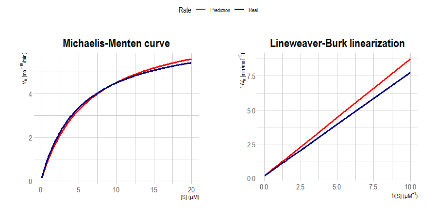
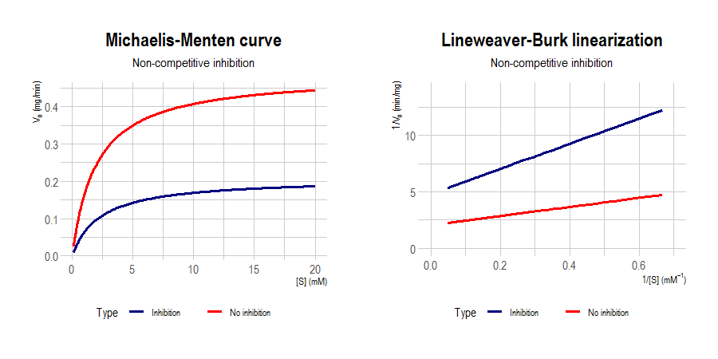
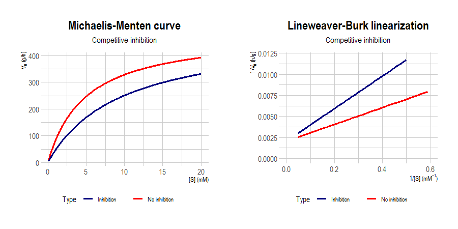

# Michaelis-Menten equation for reaction rate

Michaelis-Menten equation<sup><a href="#ref1">1</a></sup> is a well-known model in biochemistry for enzyme kinetics. This takes the concentration of a certain substrate  and maximum rate  to calculate the reaction rate:

> 
 
where  is the **Michaelis constant**. When an inhibitor<sup><a href="#ref2">2</a></sup> enters into action, the equation above takes the form:

> 

where  is the **constant of inhibition** and  is the **inhibitor concentration**.

I made this R script to calculate the rate of the reaction via **Michaelis-Menten** and also with the possibility to use **Lineweaver-Burk** linearization:

> 

... and

> 

When given rate in presence of the inhibitor and its corresponding concetration , you can predict , , **inhibition factor**  and  (both for **inhibiton** and **no inhibition** when **non-competitive inhibition** is predicted).

## Import

You can download `michaelis_functions.R` and import to your project:

```r
source('michaelis_functions.R')
```

## How to use?

This script has two functions: `michaelis.eq()` and `michaelisPredict()`.

|Function|Usage|
|:---:|:---|
|`michaelis.eq()`|Calculate the rate of the reaction **(or its inverse)** given the **substrate concentration**, **Vmax** and **Km**. Calculate the rate in presence of an inhibitor is **inhibition factor** `inh.factor` is present|
|`michaelisPredict()`|Predict **Vmax** and **Km** values given the **substrate concentration** and **rate of the reaction**. When an inhibitor is present (given **rate in presence of the inhibitor** `rate.inh` and **inhibitor concentration** `inh.conc`), values for **KI** and **inhibition factor** are predicted besides **type of inhibition**. When inhibition is **non-competitive**, Vmax is divided into **Vmax with no inhibition** and **Vmax with inhibition**.|

`michaelis.eq()` has five arguments:

- **data**: Substrate concentration
- **Vmax**: Maximum rate of the reaction
- **Km**: Michaelis constant
- **inh.factor**: Inhibition factor
- **linear**: Lineweaver-Burk linearization. Calculate the inverse of the reaction rate. Defaults to `FALSE`

`michaelisPredict()` has four arguments:

- **substrate**: Substrate concentration
- **rate**: Rate of the reaction
- **rate.inh**: Rate of the reaction in presence of an inhibitor
- **inh.conc**: Inhibitor concentration

**NOTE**: If you want to calculate parameters of inhibition and type of inhibition with `michaelisPredict()`, you always need to specify **rate**, **rate.inh** and **inh.conc** because they are calculated by comparison.

## Plot examples

Here I loaded an spreadsheet with values for substrate concentration and rate of the reaction. I predicted  and  and plot graphs for both Michaelis-Menten and Lineweaver-Burk with predicted and real values.



I also predicted and plot rates for **competitive** and **non-competitive** types of inhibition.




You can see an example in [enzyme_example.R](https://github.com/itsmiguelrojas/michaelis-menten/blob/main/R/enzyme_example.R).

## References

1. <p id="ref1">Srinivasan, B. (2021), A guide to the Michaelis–Menten equation: steady state and beyond. <em>FEBS J</em>. https://doi.org/10.1111/febs.16124</p>
2. <p id="ref2">Lopina, O. D. (2017). Enzyme Inhibitors and Activators. <em>IntechOpen</em>. https://doi.org/10.5772/67248</p>
