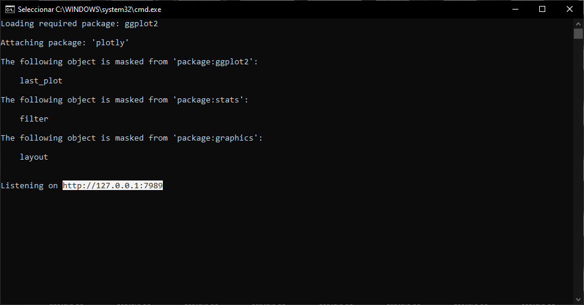
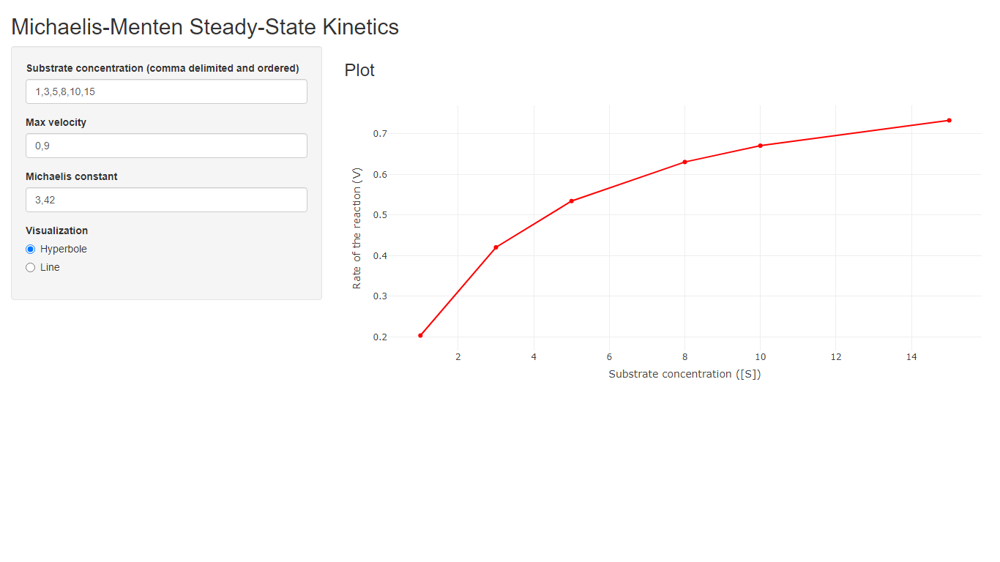
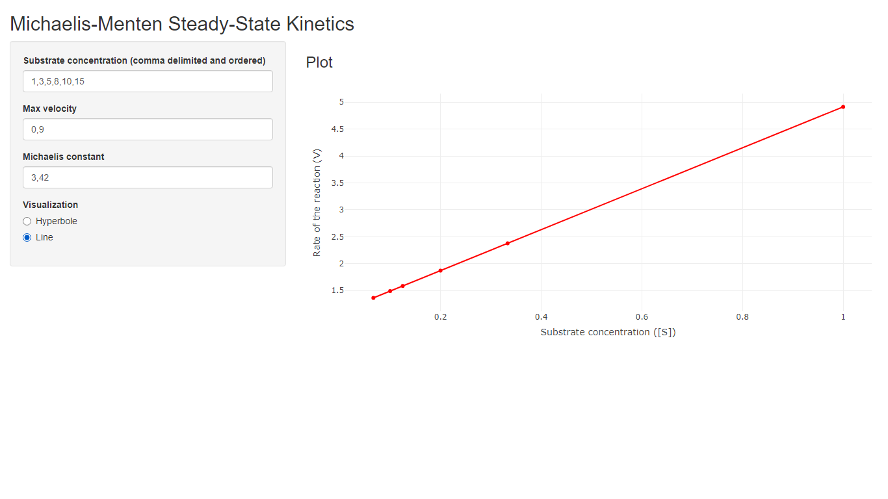

# Michaelis-Menten equation for reaction rate

Michaelis-Menten equation<sup><a href="#ref1">1</a></sup> is a well-known model in biochemistry for enzyme kinetics. This takes the concentration of a certain substrate $[S]$ and maximum rate $V_{max}$ to calculate the reaction rate:

> $v=\frac{V_{max}[S]}{K_{M}\enspace+\enspace[S]}$
 
where $K_{M}$ is the **Michaelis constant**. When an inhibitor<sup><a href="#ref2">2</a></sup> enters into action, the equation above takes the form:

> $v=\frac{V_{max}[S]}{\left(1\enspace+\enspace\frac{[I]}{K_I}\right)K_M\enspace+\enspace[S]}$

where $K_{I}$ is the **constant of inhibition** and $[I]$ is the **inhibitor concentration**.

I made this R script to calculate the rate of the reaction via **Michaelis-Menten** and also with the possibility to use **Lineweaver-Burk** linearization:

> $\frac{1}{v}=\frac{K_M}{V_{max}}\cdot\frac{1}{[S]}+\frac{1}{V_{max}}$

... and

> $\frac{1}{v}=\left(1 + \frac{[I]}{K_I}\right)\frac{K_M}{V_{max}}\cdot\frac{1}{[S]}+\frac{1}{V_{max}}$

When given rate in presence of the inhibitor and its corresponding concetration $[I]$, you can predict $K_{M}$, $K_{I}$, **inhibition factor** $\alpha= 1 + \frac{[I]}{K_I}$ and $V_{max}$ (both for **inhibiton** and **no inhibition** when **non-competitive inhibition** is predicted).

## Import

You can download `michaelis_functions.R` and import to your project:

```r
source('michaelis_functions.R')
```

## How to use?

This script has two functions: `michaelis.eq()` and `michaelisPredict()`.

|Function|Usage|
|:---:|:---|
|`michaelis.eq()`|Calculate the rate of the reaction **(or its inverse)** given the **substrate concentration**, **Vmax** and **Km**. Calculate the rate in presence of an inhibitor if **inhibition factor** `inh.factor` is present.|
|`michaelisPredict()`|Predict **Vmax** and **Km** values given the **substrate concentration** and **rate of the reaction**. When an inhibitor is present (given **rate in presence of the inhibitor** `rate.inh` and **inhibitor concentration** `inh.conc`), values for **KI** and **inhibition factor** are predicted besides **type of inhibition**. When inhibition is **non-competitive**, Vmax is divided into **Vmax with no inhibition** and **Vmax with inhibition**.|

`michaelis.eq()` has five arguments:

- **substrate**: Substrate concentration
- **Vmax**: Maximum rate of the reaction
- **Km**: Michaelis constant
- **inh.factor**: Inhibition factor
- **linear**: Lineweaver-Burk linearization. Calculate the inverse of the reaction rate. Defaults to `FALSE`

`michaelisPredict()` has four arguments:

- **substrate**: Substrate concentration
- **rate**: Rate of the reaction
- **rate.inh**: Rate of the reaction in presence of an inhibitor
- **inh.conc**: Inhibitor concentration

**NOTE**: If you want to calculate parameters of inhibition and type of inhibition with `michaelisPredict()`, you always need to specify **rate**, **rate.inh** and **inh.conc** because they are calculated by comparison.

## Plot examples

Here I loaded an spreadsheet with values for substrate concentration and rate of the reaction. I predicted $K_{M}$ and $V_{max}$ and plot graphs for both Michaelis-Menten and Lineweaver-Burk with predicted and real values.


I also predicted and plot rates for **competitive** and **non-competitive** types of inhibition.


You can see an example in [enzyme_example.R](https://github.com/itsmiguelrojas/michaelis-menten/blob/main/R/enzyme_example.R).

## Shiny application

I have created a [Shiny app](https://github.com/itsmiguelrojas/michaelis-menten/tree/main/app) that opens in web browser. I made a `.bat` file and tested it on Windows only (the same should work for Linux via shell script `.sh` file if I could create the file).

To open this app, follow these instructions:

1. [Donwload and install R](https://cloud.r-project.org/) (RStudio is not necessary). If you can't or don't want to install the program, you can donwload [R Portable](https://sourceforge.net/projects/rportable/) and unpackage it in `app` folder. **NOTE**: you will also need to install `shiny`, `ggplot2` and `plotly` in order to the app to run.

2. Open `executeApp.bat` and edit the third line containing the path to the `Rscript.exe`:

 - If you downloaded R from The R Project, this path is often `C:\Program Files\R\R-x.x.x\bin`. Check where you have installed R.
    
    ```{sh}
    @echo off
    C:
    PATH "C:\Program Files\R\R-x.x.x\bin"
    cd "%~dp0"
    Rscript "%~dp0enzymeApp.R"
    exit
    ```
    
 - If you downloaded R Portable and unpackaged it in `app` folder, the path is often `%~dp0\R-Portable\App\R-Portable\bin` (`%~dp0` calls dinamically for the path where the files are located).
    
    ```{sh}
    @echo off
    C:
    PATH "%~dp0\R-Portable\App\R-Portable\bin"
    cd "%~dp0"
    Rscript "%~dp0enzymeApp.R"
    exit
    ```
  
3. Save the `.bat` file and run it. It should open a command line where you will see a port at the end like `http://127.0.0.1:xxxx`. Copy this port and paste in a web browser.
  

  
4. In the web browser, you will see an interface like this. You can visualize the plot as **hyperbole** or **line** and enter **Michaelis constant**, **Vmax** and **substrate concentrations**.
  



## References

1. <p id="ref1">Srinivasan, B. (2021), A guide to the Michaelis–Menten equation: steady state and beyond. <em>FEBS J</em>. https://doi.org/10.1111/febs.16124</p>
2. <p id="ref2">Lopina, O. D. (2017). Enzyme Inhibitors and Activators. <em>IntechOpen</em>. https://doi.org/10.5772/67248</p>
