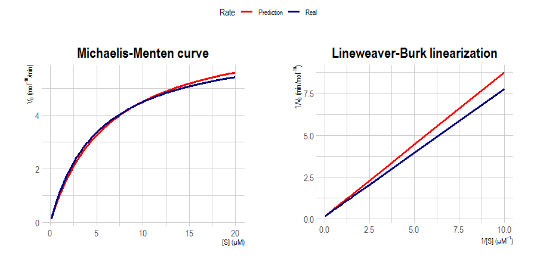

# Michaelis-Menten equation for reaction rate

[Michaelis-Menten equation](https://doi.org/10.1111/febs.16124) is a well-known model in biochemistry for enzyme kinetics. This takes the concentration of a certain substrate  and maximum rate  to calculate the reaction rate:


where  is the **Michaelis constant**.

I made this R script to calculate the rate of the reaction via **Michaelis-Menten** and also with the possibility to use **Lineweaver-Burk** linearization:


You can predict  and  too.

## Import

You can download `michaelis_functions.R` and import to your project:

```r
source('michaelis_functions.R')
```

## How to use?

This script has two functions: `michaelis.eq()` and `michaelisPredict()`.

|Function|Usage|
|:---:|:---:|
|`michaelis.eq()`|Calculate the rate of the reaction **(or its inverse)** given the **substrate concentration**, **Vmax** and **Km**.|
|`michaelisPredict()`|Predict **Vmax** and **Km** values given the **substrate concentration** and **rate of the reaction**.|

`michaelis.eq()` has four arguments:

- **data**: Substrate concentration
- **Vmax**: Maximum rate of the reaction
- **Km**: Michaelis constant
- **linear**: Lineweaver-Burk linearization. Calculate the inverse of the reaction rate. Defaults to `FALSE`

`michaelisPredict()` has two arguments:

- **substrate**: Substrate concentration
- **rate**: Rate of the reaction

## Plot example

Here I loaded an spreadsheet with values for substrate concentration and rate of the reaction. I predicted  and  and plot graphs for both Michaelis-Menten and Lineweaver-Burk with predicted and real values. You can see an example in [enzyme_example.R](https://github.com/itsmiguelrojas/michaelis-menten/blob/main/enzyme_example.R).



## References

- Srinivasan, B. (2021), A guide to the Michaelis–Menten equation: steady state and beyond. *FEBS J*. https://doi.org/10.1111/febs.16124
